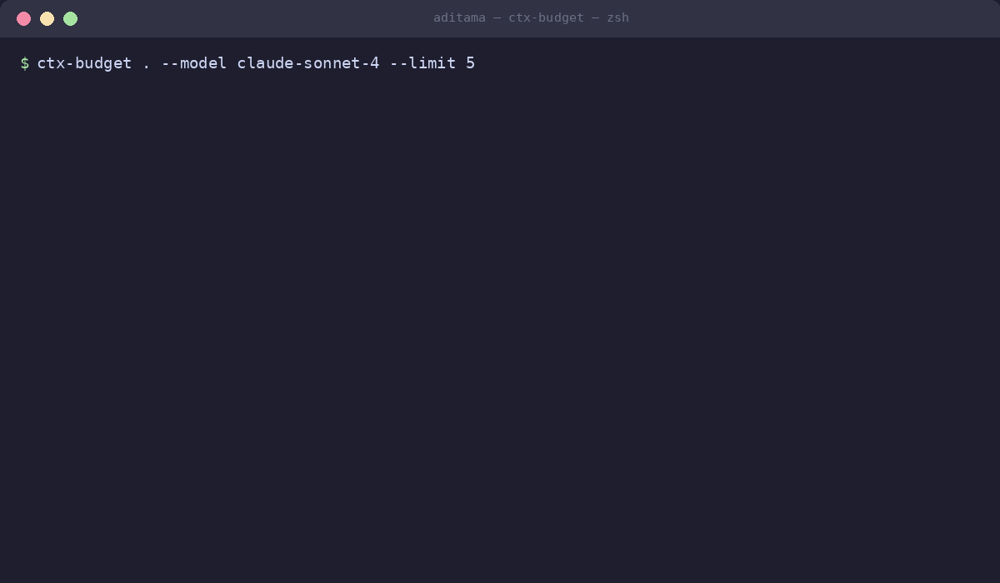

# ctx-budget

Token distribution analyzer for LLM context windows.

Scans project files, estimates token counts, and reports usage per file before sending code to Claude, GPT-4, Gemini, or local models.

[](https://crates.io/crates/ctx-budget)
[](LICENSE)
[](https://github.com/tamaraw01/ctx-budget/actions/workflows/ci.yml)
[](https://github.com/tamaraw01/ctx-budget/releases)



## Problem

Feeding a repository into an LLM context window risks exceeding model limits (most models: 128K-1M) or wasting tokens on unnecessary files.

Most models have known limits. Choosing the right files for each model means fewer API calls and lower costs.

`ctx-budget` measures token distribution across project files so you can select relevant files before making API calls.

## Features

- **Token estimation**: Blended word/character heuristic (~95% correlation with GPT-2 BPE)
- **Directory filtering**: Excludes `node_modules`, `.git`, `target`, `__pycache__`, `.venv`, `vendor`, and custom paths
- **Multiple output formats**: Text (terminal), JSON (automation), CSV (spreadsheets)
- **30+ languages**: Auto-detects Rust, Python, Go, TypeScript, JavaScript, C/C++, Shell, SQL, and others
- **Stream processing**: Low memory usage on large codebases
- **Config-driven models**: Load models from `models.toml`, override via `--models-path`, or specify via `--model` flag
- **Zero runtime dependencies**: Static binary

## Installation

### From Source

```bash
git clone https://github.com/tamaraw01/ctx-budget
cd ctx-budget
cargo build --release
```

The binary will be at `target/release/ctx-budget`.

### Cargo

```bash
cargo install ctx-budget
```

## Usage

### Basic Scan

Scan the current directory:

```bash
ctx-budget .
```

### Models & Context Windows

ctx-budget ships with 25 models across 4 tiers. Each tier represents a different price-to-capability tradeoff.

#### Configuration System

Models are stored in `models.toml` in the project root (or a custom path via `--models-path`). Each model definition includes:

- **Model ID**: Short identifier for CLI use (`claude-sonnet-5`, `gpt-6-astra`)
- **Context window**: Total tokens available (e.g., 1M, 200K, 128K)
- **Max output**: Tokens reserved for generation
- **Pricing**: Input and output cost per 1M tokens
- **Release date**: When the model became available
- **Description**: Use cases and notable features

#### Frontier: 1M+ Context Windows

For analyzing entire codebases, long documents, or multi-file contexts in a single call.

| Model ID | Provider | Window | Output | Input Cost | Released |
|----------|----------|--------|--------|------------|----------|
| `gpt-6-astra` | OpenAI | 1.05M | 128K | $10/1M | Sep 2026 |
| `claude-opus-5` | Anthropic | 1M | 128K | $5/1M | Jun 2026 |
| `claude-opus-4-8` | Anthropic | 1M | 128K | $5/1M | Jun 2026 |
| `claude-sonnet-5` | Anthropic | 1M | 128K | $2/1M | Jun 2026 |
| `claude-fable-5-1` | Anthropic | 1M | 128K | $10/1M | Sep 2026 |
| `gemini-3-5-flash` | Google | 1M | 64K | $0.075/1M | May 2026 |
| `gemini-3-1-pro` | Google | 1.04M | 64K | $0.50/1M | Feb 2026 |
| `gpt-4-1` | OpenAI | 1.04M | 32K | $5/1M | Sep 2026 |
| `deepseek-v4-pro` | DeepSeek | 1.04M | 128K | $0.43/1M | Apr 2026 |
| `deepseek-v4-flash` | DeepSeek | 1.04M | 384K | $0.14/1M | Apr 2026 |
| `llama-4-scout` | Meta | 10M | 32K | $0.15/1M | Apr 2025 |
| `glm-5-3` | Zhipu AI | 1M | 128K | $1.40/1M | Aug 2026 |
| `glm-5-3-flash` | Zhipu AI | 1M | 128K | $0.15/1M | Aug 2026 |
| `gemini-2-0-flash` | Google | 1M | 8K | $0.10/1M | Dec 2025 |

**Example:** Analyze an entire Rails application with 150K tokens of code:

```bash
ctx-budget . --model claude-sonnet-5
```

#### High-Performance: 200K-500K Context

For large projects that fit in a single request without the full 1M overhead.

| Model ID | Provider | Window | Output | Input Cost | Released |
|----------|----------|--------|--------|------------|----------|
| `grok-4-5` | xAI | 500K | 64K | $2/1M | Jul 2026 |
| `gpt-5` | OpenAI | 400K | 128K | $5/1M | May 2026 |
| `mistral-large-3` | Mistral | 262K | 16K | $0.50/1M | Mar 2026 |
| `claude-haiku-4-5` | Anthropic | 200K | 64K | $0.80/1M | Nov 2025 |
| `claude-sonnet-4-6` | Anthropic | 200K | 64K | $3/1M | Jun 2024 |

**Example:** Analyze a Python package with 250K tokens:

```bash
ctx-budget /path/to/django --model grok-4-5
```

#### Standard: 128K Context

For focused analysis of individual modules or services.

| Model ID | Provider | Window | Output | Input Cost | Released |
|----------|----------|--------|--------|------------|----------|
| `llama-3-3-70b` | Meta | 131K | 4K | $0.12/1M | Dec 2025 |
| `qwen-max` | Alibaba | 128K | 4K | $0.40/1M | Dec 2025 |
| `mistral-large-2` | Mistral | 128K | 8K | $2/1M | Nov 2025 |

**Example:** Analyze a single service with 100K tokens:

```bash
ctx-budget . --model mistral-large-2
```

#### Legacy

Older models retained for backward compatibility. Use frontier or high-performance equivalents instead. Pricing and capability improved significantly.

| Model ID | Provider | Window | Note |
|----------|----------|--------|------|
| `gpt-4o` | OpenAI | 128K | Use `gpt-4-1` (1M context, same cost) |
| `gpt-5-6` | OpenAI | 1.05M | Superseded by `gpt-6-astra` |
| `claude-sonnet-4` | Anthropic | 200K | Use `claude-sonnet-5` (1M context, same cost) |

### Specify Model Window and Limit

```bash
ctx-budget /path/to/project --model claude-sonnet-4 --limit 10
```

### The --model Flag

Choose a model by ID. ctx-budget reports the model's context window and shows tokens as a percentage of available capacity:

```bash
ctx-budget . --model gpt-6-astra
# Output shows all tokens as % of 1.05M window

ctx-budget . --model claude-haiku-4-5
# Output shows all tokens as % of 200K window
```

Default model: `gpt-6-astra` (1.05M window). If a model is not found in `models.toml`, the tool exits with an error listing available models.

### External Model Override via --models-path

Use a custom `models.toml` file to add models, override pricing, or test experimental configurations:

```bash
ctx-budget . --models-path ./my-models.toml --model my-custom-model
```

Format your custom file following the same TOML structure:

```toml
[models.my-custom-model]
name = "My Custom Model"
provider = "Custom"
context_window = 500000
max_output = 128000
input_price_per_1m = 1.00
output_price_per_1m = 5.00
released = "2026-09-12"
description = "Your model description here"
```

### JSON Output

```bash
ctx-budget . --output json | jq .
```

### CSV Export

```bash
ctx-budget . --output csv > tokens.csv
```

### Custom Exclusions

```bash
ctx-budget . --exclude-dirs "dist,build,coverage"
```

## Output Example

```
=== ctx-budget Report ===
Model: gpt-4o

Summary:
  Files scanned: 42
  Total chars:   614,428
  Total tokens:  153,607

Languages found: 3
  Rust                 35 file(s)
  Markdown             5 file(s)
  TOML                 2 file(s)

Top 10 files by token count:
    1.  28,451 tokens | Rust                 | src/engine.rs
    2.  12,304 tokens | Rust                 | src/analysis.rs
    3.   9,876 tokens | Markdown             | docs/architecture.md
    4.   7,234 tokens | Rust                 | src/main.rs
    5.   6,145 tokens | Rust                 | tests/integration.rs
```

## How Token Counting Works

`ctx-budget` uses a blended heuristic:

1. Word count: ~1.3 tokens per word
2. Character count: ~0.25 tokens per character
3. Average of both estimates

This approach avoids linking against heavy tokenizer libraries while providing estimates accurate enough for context window planning.

## Performance

Tested on a repository with 1,000 source files (100MB):

- Execution time: < 0.8 seconds
- Peak RAM: < 15MB

## Testing

Run unit and integration tests:

```bash
cargo test --release
```

Check code formatting and lints:

```bash
cargo fmt --check
cargo clippy --release
```

## License

GNU General Public License v3.0 (GPL-3.0). See [LICENSE](LICENSE) for details.
